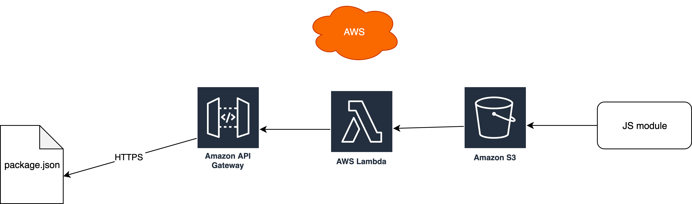
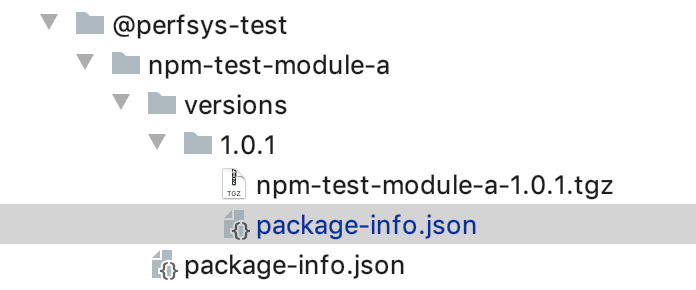

AWS Serverless NPM repository
===========================

100% serverless solution for AWS account to allow initiate NPM repository and use it as a repo.  
Great alternative for opensource and commercial apps, as it is very cheap to operate. It does NOT use any EC2 or other resorces.  
Only AWS API Gateway, AWS Lambdas, AWS S3



<a name="about"></a>About Us
-------------------------------
Perfsys is the DevOps & AWS Cloud Solutions company. We help tech companies 
scale engineering capacity and deliver perfect systems.  
  
[https://perfsys.com](https://perfsys.com)  
[company@perfsys.net](mailto:company@perfsys.net)


<a name="about"></a>Follow Us
-------------------------------

[https://www.linkedin.com/company/perfsys-com/](https://www.linkedin.com/company/perfsys-com/)  
[https://clutch.co/profile/perfsys/](https://clutch.co/profile/perfsys)  
[https://twitter.com/perfsysnet](https://twitter.com/perfsysnet)
[https://www.facebook.com/perfsys/](https://www.facebook.com/perfsys/)    


Prerequisites
-----------------

Install [NodeJS](https://nodejs.org/en/download/ )
NodeJS is required to build

Install [Serverless](https://serverless.com/framework/docs/getting-started/) framework.
Serverless Framework is a CLI tool that allows users to build & deploy auto-scaling, pay-per-execution, event-driven functions


Install [AWS CLI](https://docs.aws.amazon.com/cli/latest/userguide/awscli-install-windows.html)
AWS CLI is an open source tool built on top of the AWS SDK for Python (Boto) that provides commands for interacting with AWS services. With minimal configuration, you can start using all of the functionality provided by the AWS Management Console from your favorite terminal program


AWS Configure
https://docs.aws.amazon.com/cli/latest/userguide/cli-chap-getting-started.html
Configure settings that the AWS Command Line Interface uses when interacting with AWS, such as your security credentials and the default region

Step 1: NPM repository installation
------------------------
1. **Install NodeJS dependencies:**

```bash
npm install
```

2. **Make deploy.sh executable**
```bash 
chmod +x ./deploy.sh
```

3. **AWS_PROFILE**
Update AWS_PROFILE according to AWS Configure step above

4. **NPM_REGISTRY_NAME**
This will be the name of the NPR registry

5. **NPM_REGISTRY_REGION**
Optionally it is possible to NPM_REGISTRY_REGION, defaut is  `region: us-east-1`

6. **Deploy to AWS:**

```bash
./deploy.sh
```

7. **Copy `Stacl Outputs` information**
`NPMRegistryBucketName:`  
`ServiceEndpoint:`

Step 2: Build & publish NPM module
-----------------------------------

1. **Build tgz with npm**  
``npm pack``

2. Find .tgz file in the same folder

3. Copy .tgz to S3 bucket with artifacts `NPMRegistryBucketName`

4. Make sure Tree structure corresponds to @scope/module/versions/version

5. package-info.json file is optional




<a name="features"></a>Features
-------------------------------
* Get package-info about module, including all the versions
* Form TGZ NPM module  link to download TGZ
* Allow to download TRZ dist NPM module file from AWS S3 via AWS API Gateway

## <a name="licensing"></a>Licensing

Serverless is licensed under the [MIT License](./LICENSE).

All files located in the node_modules and external directories are externally maintained libraries used by this software which have their own licenses; we recommend you read them, as their terms may differ from the terms in the MIT License.
